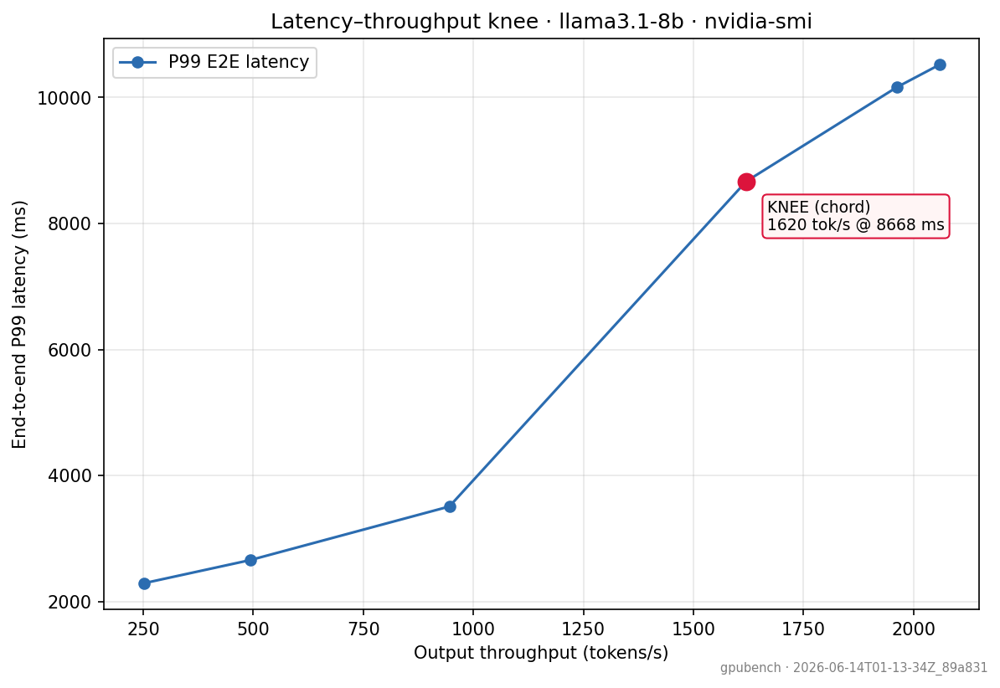
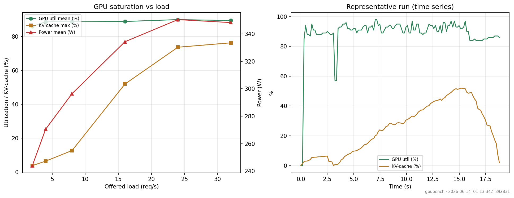

# llm_inference_benchmarking (`gpubench`)

A benchmarking harness for LLM inference on a single GPU. It starts a vLLM server,
throws traffic at it with a load generator I wrote, watches the card with
nvidia-smi, and works out how hard you can push one GPU before latency falls apart.

I built it to learn inference serving properly. Anyone can call an LLM API; far
fewer people can tell you how many users one GPU actually handles, or explain why
it slows down. That was the skill I wanted.

The rule I held myself to was that the numbers have to be right, because a
benchmark that lies is worse than no benchmark. So every metric gets cross-checked
against vLLM's own `vllm bench serve`, and the math is pinned down with tests.

If you're new to this, start with [TEACHING.md](TEACHING.md). It explains the whole
thing from scratch using a restaurant-kitchen analogy.



---

## Results

I ran this on a single A100 (through Colab) against Llama-3.1-8B with 512-token
prompts and 128-token outputs, sweeping the request rate from 2 to 32 per second.
Then I pointed vLLM's own `vllm bench serve` at the same server to check my work.
The two agreed to within about 1 to 6 percent, so I'm confident the harness is
measuring what it should.

| Offered req/s | Achieved | TTFT p99 | TPOT p99 | Output tok/s | Goodput | KV-cache |
|---:|---:|---:|---:|---:|---:|---:|
| 2  | 1.96  | 101 ms  | 17 ms | 251  | 1.96 | 4%  |
| 4  | 3.85  | 112 ms  | 20 ms | 493  | 3.85 | 6%  |
| 8  | 7.39  | 160 ms  | 27 ms | 945  | 7.39 | 13% |
| 16 | 12.65 | 317 ms  | 67 ms | 1620 | 6.14 | 52% |
| 24 | 15.33 | 689 ms  | 79 ms | 1962 | 4.14 | 74% |
| 32 | 16.09 | 1970 ms | 82 ms | 2059 | 0.00 | 76% |

Goodput is the number of requests per second that met an SLO of TTFT under 1s and
TPOT under 50ms.

A few things this tells you:

The server maxes out around 16 requests per second, or roughly 2,000 output tokens
a second. You can offer more than that, but you don't get more work out the other
end, you just pay for it in latency.

The useful capacity is lower than the raw number. Holding it to the SLO above, you
get about 7 req/s before requests start missing the deadline. After that, per-token
latency drifts past 50ms and goodput falls off fast, all the way to zero at 32 req/s.

What's actually slowing it down is the decode step, not request queueing and not
running out of KV-cache memory. First-token latency stays low (under 350ms even at
16 req/s) and the KV cache never fills up, topping out around 76%. The giveaway is
on the GPU itself: it sits at about 89% utilization but power holds around 350W,
well under the card's limit. That is what a memory-bandwidth-bound decode looks like.

One more thing, because it was the most useful lesson of the whole project. My first
run reported TTFT about five times too high, and I only caught it because I compared
against vLLM's official tool. The problem wasn't the server at all. It was my load
generator's HTTP connection pool being too small, so requests were piling up on my
side before they ever reached vLLM. Once I sized the pool correctly everything lined
up. That is the entire reason you cross-check your own numbers against something you
already trust.



---

## What it measures

Per sweep cell it reports, over a steady-state window:

- **TTFT** — time to first token (prefill + queueing)
- **TPOT / ITL** — time per output token / inter-token latency (decode)
- **E2E latency** — full request latency, with **P50 / P95 / P99**
- **Throughput** — output tok/s, total tok/s, requests/s (window-based)
- **Goodput** — throughput of requests meeting an SLO (the number that matters)
- **GPU telemetry** — utilization, HBM used, power draw, KV-cache occupancy
- **Failures** — by class (timeout, HTTP error, truncated stream, …)

It sweeps **request rate**, **concurrency**, **prompt length**, and **output
length**, and finds the **saturation knee** where throughput plateaus while P99
latency climbs.

---

## Why it's credible (the engineering, not the buzzwords)

- **Coordinated-omission correct.** The open-loop generator pre-schedules
  *absolute* arrival times (a Poisson process) and fires without waiting for prior
  responses, recording *intended* vs *actual* send time. A slow server can never
  throttle the offered load and hide tail latency — the classic home-grown
  benchmark bug.
- **Cross-checked against an oracle.** The same server is hit by vLLM's official
  `vllm bench serve` with matched params; our numbers must match it *and* the
  server's own `/metrics` histograms. Three independent measurements agreeing is
  the validation gate.
- **Statistically honest.** Window-based throughput (never sum-of-per-request
  rates); `TPOT = (E2E − TTFT)/(output_tokens − 1)`; percentiles via
  `numpy.percentile` with a minimum-sample-size guard (no fabricated P99s);
  failures excluded from latency but tracked separately; goodput is a strict SLO
  conjunction.
- **Reproducible.** Pinned vLLM version, seeded RNG, and an environment manifest
  (GPU, driver, CUDA, model) written into every run. Raw per-request data is kept
  as JSONL so any metric can be recomputed.
- **Telemetry done right.** vLLM's V1 `/metrics` names (`vllm:kv_cache_usage_perc`,
  `vllm:inter_token_latency_seconds`) with legacy fallback; monotonic-clock
  alignment of GPU samples to load windows; honest `synthetic` flag when no GPU.

The design and these decisions were produced and **adversarially reviewed by a
multi-agent workflow** against current vLLM / NVIDIA / AWS docs before
implementation.

---

## Architecture

```
┌──────────────────────── orchestrator ────────────────────────┐
│  sweep matrix · monotonic fences · writes JSONL/CSV/manifest  │
└───┬───────────────────────┬───────────────────────┬──────────┘
    │                       │                       │
┌───▼────┐   HTTP/SSE   ┌───▼─────────┐       ┌─────▼──────────┐
│ vLLM   │◄─────────────│  loadgen    │       │  telemetry      │
│ server │  /v1/        │ open+closed │       │ NVML/nvidia-smi │
│  (or   │  completions │ loop, CO-   │       │ + vLLM /metrics │
│  mock) │  /tokenize   │ correct     │       │ (monotonic)     │
│/metrics│              └─────────────┘       └────────────────┘
└────────┘                     │                       │
    └──────────────────────────▼───────────────────────┘
                       ┌────────────────┐
                       │  metrics (the  │  ← single aggregation path
                       │     ruler)     │
                       └───────┬────────┘
                       ┌───────▼────────┐
                       │   reporter     │ → summary.csv/json + 4 plots
                       └────────────────┘
```

---

## Quickstart

### macOS / any laptop — no GPU (mock server)

```bash
python3.11 -m venv .venv && source .venv/bin/activate
pip install -e .

gpubench serve-mock --port 8137 &            # GPU-free vLLM-shaped server
gpubench run --config configs/smoke.yaml --base-url http://127.0.0.1:8137
# -> results/<run_id>/summary.csv + plots/
```

The mock streams fake tokens with configurable TTFT/ITL and a saturation curve,
so the *entire* measurement + plotting pipeline is exercised offline. Or just:
`./scripts/run_mock.sh configs/mock.yaml`.

### Google Colab Pro — real GPU, first true numbers

Open [`notebooks/colab_validation.ipynb`](notebooks/colab_validation.ipynb):
set a `HF_TOKEN` secret (with the Llama-3.1 license accepted), pick a GPU runtime,
Run All. It installs vLLM natively (no Docker), runs the open-loop sweep, and
cross-checks against `vllm bench serve`.

### AWS (or any single-GPU Linux box) — full Dockerized run

```bash
export HF_TOKEN=hf_...          # account must have accepted the Llama-3.1 license
docker compose up --build       # vLLM server + harness; results land in ./results
```

Pick an instance with `gpubench plan` (Llama-3.1-8B memory math):

```bash
gpubench plan                   # table for 16/24/40/48/80 GB
gpubench plan --gpu-mem 24 --ctx 4096
```

---

## Interpreting the output

`results/<run_id>/` contains:

- `summary.csv` / `summary.json` — one row per sweep cell (all latencies in **ms**)
- `configs/<cell>/requests.jsonl` — raw per-request truth (recompute anything)
- `configs/<cell>/telemetry.csv` — time-aligned GPU + vLLM `/metrics`
- `run_manifest.json` — versions, seeds, GPU, full resolved config
- `plots/` — four charts:

| Plot | What it proves |
|---|---|
| `pareto_knee.png` | Output tok/s vs P99 latency with the **knee** marked — your max sustainable load. |
| `ttft_tpot_vs_load.png` | Splits latency into **TTFT (queue/prefill)** vs **TPOT (decode)** so a regression points at the right fix. |
| `gpu_saturation.png` | Util / KV-cache / power vs load + a time series — *why* it saturated (often KV-cache hitting ~100% before compute). |
| `goodput_vs_load.png` | Raw throughput vs **goodput**; the shaded gap is work that breached the SLO and is useless. |

---

## Repo layout

```
src/gpubench/
  schema.py        canonical RequestRecord + vLLM metric-name constants + summary columns
  config.py        typed configs, pinned vLLM version, Llama-3.1-8B memory math, YAML loader
  metrics.py       the single "ruler": finalize + aggregate (TTFT/TPOT/ITL/throughput/goodput)
  loadgen.py       coordinated-omission-correct async open/closed-loop generator + SSE parse
  telemetry.py     GPU backends (NVML/nvidia-smi/synthetic) + vLLM /metrics scraper + knee signals
  serving.py       vLLM launch + `vllm bench serve` oracle command builders
  mock_server.py   GPU-free vLLM-shaped server (the macOS dev + test fixture)
  orchestrator.py  the hub: drives the sweep, writes all on-disk artifacts
  reporter.py      summary (seconds -> ms here) + knee detection + the four plots
  cli.py           gpubench serve-mock | run | report | plan | crosscheck
configs/           mock · smoke · colab · aws (one YAML per platform, sectioned)
scripts/           serve_vllm.sh · run_bench_serve_oracle.sh · env_manifest.sh · run_mock.sh
notebooks/         colab_validation.ipynb
tests/             metric math, SSE parse, Poisson arrivals, GQA memory, telemetry, serve flags
```

Run the tests: `pip install -e . pytest pytest-asyncio && pytest -q`.

---

## License

MIT. Model weights are **not** included; Llama-3.1-8B is gated — accept Meta's
license on Hugging Face and supply your own `HF_TOKEN`.
