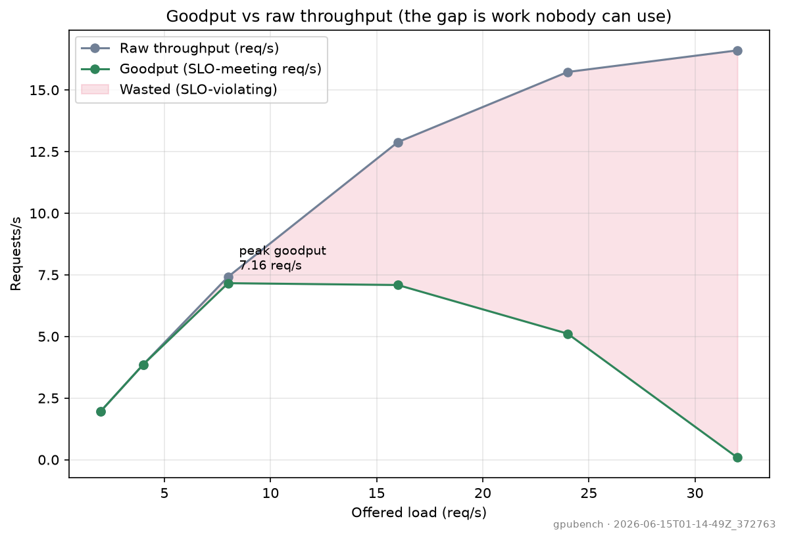
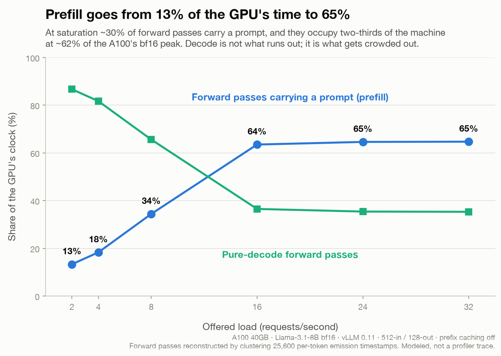

# llm_inference_benchmarking (`gpubench`)

A benchmarking harness for LLM inference on a single GPU. It starts a vLLM server,
throws traffic at it with a load generator I wrote, watches the card with
nvidia-smi, and works out how hard you can push one GPU before latency falls apart.

I built it to learn inference serving properly. Anyone can call an LLM API; far
fewer people can tell you how many users one GPU actually handles, or explain why
it slows down. That was the skill I wanted.

The rule I held myself to was that the numbers have to be right, because a
benchmark that lies is worse than no benchmark. So every metric gets cross-checked
against vLLM's own `vllm bench serve`, and the math is pinned down with tests.

If you're new to this, start with [TEACHING.md](TEACHING.md). It explains the whole
thing from scratch using a restaurant-kitchen analogy.



*One A100 completed 16.6 requests/second. Under a latency target of TTFT ≤ 1s and TPOT ≤
50ms, about 7 of them counted. The pink gap is work nobody can use. Plot and raw data:
[`results_published/cloud_a100_40gb`](results_published/cloud_a100_40gb).*

---

## Results

Two independent runs of the same open-loop sweep on a single cloud A100 40 GB
(Llama-3.1-8B bf16, vLLM 0.11, 512-token prompts, 128-token outputs, 200 requests per
load level, prefix caching off, real `nvidia-smi` telemetry). They agree on output throughput to within
0.8% at every load level and 0.2% at the knee (1,649 vs 1,647 output tok/s). Both are
published, raw data and all, in
[`results_published/cloud_a100_40gb`](results_published/cloud_a100_40gb).

Numbers below are from run `2026-06-15T01-14-49Z_372763`. All latencies in ms.

| Offered req/s | Achieved | TTFT p50 | TPOT p50 | TPOT p95 | Output tok/s | Goodput | SLO attainment |
|---:|---:|---:|---:|---:|---:|---:|---:|
| 2  | 1.96  | 62  | 15.0 | 16.0 | 252   | 1.96 | 100% |
| 4  | 3.86  | 64  | 16.8 | 18.3 | 494   | 3.86 | 100% |
| 8  | 7.42  | 73  | 23.4 | 25.3 | 950   | 7.16 | 97%  |
| 16 | 12.88 | 134 | 48.1 | 61.6 | 1,649 | 7.09 | 55%  |
| 24 | 15.73 | 265 | 60.1 | 74.6 | 2,013 | 5.11 | 33%  |
| 32 | 16.61 | 682 | 60.2 | 77.9 | 2,125 | 0.08 | 0.5% |

Goodput counts only requests meeting an SLO of TTFT ≤ 1s **and** TPOT ≤ 50ms.

**Useful capacity is less than half of raw capacity.** The most this card ever completed
was 16.6 req/s. The most it ever completed *within the SLO* was about **7.2–7.4** (7.16 in
this run, 7.42 in the repeat — see the load-generator stall note in
[`results_published/cloud_a100_40gb`](results_published/cloud_a100_40gb)). Past that,
goodput doesn't plateau, it collapses: at an offered 32 req/s the server is still
completing 16.6 req/s at 96% of its power cap, and 1 request in 200 meets the target.
Provision against 16.6 and you get a system that looks healthy on a throughput dashboard
while every user suffers.

Caveats worth stating: that ~7 req/s is the highest goodput *observed*, not a located
optimum — the sweep jumps from 8 to 16, so the real best operating point is somewhere in
that gap. And 16.6 is the top of a finite sweep, not a proven asymptotic ceiling: at rate
32 all 200 requests are sent by t≈6.2s of a ~12s window, so this measures the time to
clear a burst, not a sustained plateau.

### What actually limits it (a correction)

**This project originally concluded the ceiling was memory-bandwidth-bound decode. That
was wrong, and the published data refutes it.** The reasoning was: utilization ~92%,
power "below" the 400 W limit, KV cache never full, therefore the silicon must be stalled
on HBM. Run [`scripts/analyze_bottleneck.py`](scripts/analyze_bottleneck.py) against
either published run and the story falls apart:

- **Decode *cannot* be the compute wall — and VRAM is what proves it.** Weights are read
  once per step and amortized across the batch, but every sequence's KV must be read
  *separately*, so decode's arithmetic intensity stops climbing with the batch. And KV has
  to **fit**: a 40 GB A100 stores ~16 GB of weights, so even handing *every* remaining byte
  (~24 GB) to KV allows at most ~317 sequences at a 576-token context (75 MB each). Feed
  that ceiling back in and decode's intensity tops out at **~125 FLOP/byte**, against an
  A100 ridge of **~201**. At the batch actually observed (~145) it is **85**. Decode cannot
  reach the compute roof at any batch this card can physically hold.
  *(The batch→∞ asymptote is ~203, i.e. marginally* above *the ridge, so the asymptote alone
  settles nothing. An earlier version of this analysis claimed otherwise and was wrong;
  VRAM is what binds.)*
- **The power argument was backwards.** The "~350 W, below the 400 W limit" figure is the
  *whole-window* mean, diluted by idle ramp and drain — it is what `summary.csv` reports,
  and it is what fooled me. Over telemetry rows with GPU util ≥90%, rate 32 averages
  **384.6 W** against the 400 W cap (repeat run: 376.3 W). Memory-bound kernels draw *less*
  power; dense GEMM is what pins a power limit. High power does not by itself identify the
  limiting unit — but it is not the signature of a GPU idling on memory.
- **Prefill owns the clock.** This workload is 512-in/128-out: four prompt tokens per
  generated token. At saturation, forward passes carrying a prompt are ~30% of passes but
  consume **~65% of the GPU's clock**, at ~62% of the A100's bf16 peak. Prompt-bearing
  intervals average **4.3×** the duration of pure-decode intervals *and contain fewer decode
  emissions*, so a bigger decode batch does not explain the gap.

Both runs reproduce the split: ~30% of passes, ~65% of the clock, 4.32× vs 4.23×.



What survives from the original analysis: **decode really is bandwidth-bound in
isolation.** At rate 2 the batch is ~4 and TPOT is 15.0 ms, implying ~1.07 TB/s of weight
streaming (69% of spec) — squarely memory-bound. The error was *scope*: that is the idle
GPU. Under load, batching amortizes the weight read and prefill compute takes over.

**What this does NOT claim.** FLOP/s and GB/s here are **modeled** from token counts and
model geometry, not measured. `nvidia-smi` exposes no DRAM-throughput counter — its
memory-utilization figure is a duty cycle, not bandwidth — and the traffic model omits
activations and KV writes, so it is a *lower bound*, and a lower bound below peak cannot
rule out saturation within decode. What the reconstruction does show is that prompt-bearing
passes occupy two-thirds of elapsed time, which contradicts the original decode-only
explanation. Apportioning the remainder between compute, bandwidth and scheduler overhead
needs phase-separated DCGM/Nsight counters, or a prefill-only vs decode-only ablation. The
sweep is also a finite fill-and-drain transient, not a stationary overload.

### Three bugs, all of them in the instrument

**1. The load generator was wrong by 4.7×.** An early run reported TTFT ~4.7× too high
(746 ms vs vLLM's own `vllm bench serve` reporting 159 ms on the same server; both figures
are in the commit that fixed it, `5cbdeb0`). Not the server: my HTTP connection pool was
capped at 80 while open-loop peak in-flight reaches **138** (recomputable from the published
`requests.jsonl`), so requests queued *inside my own load generator*. Coordinated omission
was ruled out first — the intended-vs-actual send gap was ~1 ms.

**2. The bottleneck diagnosis was wrong** (see above). Caught only by doing the arithmetic.

**3. A streaming-path disruption at rate 8 that I still cannot attribute.** Seven requests
took 1.3–2.0 s to first token; the 21 requests already streaming all show SSE chunk
coalescing (`tokens_chunks_mismatch`), in a staircase ordered by start time. I first wrote
this up as a *server* stall, then as a *client* event-loop stall. **Both were overconfident.**
`schedule_delay` proves coroutines fired on time but is stamped *before* connection
acquisition, and chunk coalescing is something the server does when its output queue backs
up — which a slow reader, transport backpressure, or a stalled server output loop all
produce identically. Unresolved; the 7 requests are treated as contaminated. Details in
[`results_published/cloud_a100_40gb`](results_published/cloud_a100_40gb).

The through-line: none of these was found by staring harder at the numbers, and each one
arrived wearing a plausible story. Cross-check your ruler against one you didn't build, then
cross-check your conclusion — then check whether you can actually prove the conclusion you
just reached.

### The closed-loop sweep

A second sweep fixes concurrency (4 / 16 / 64) instead of arrival rate and varies prompt
and output length. At 512-in/128-out, going from 4 to 64 concurrent clients buys 6×
throughput (269 → 1,601 output tok/s) for 9× the first-token latency (132 → 1,203 ms),
and goodput *falls* from 16 to 64. Doubling the prompt to 1,024 tokens costs +10% TTFT
when idle and +77% when saturated — prefill contending with in-flight decode, which is
the same story from the other side.

---

## What it measures

Per sweep cell it reports, over a steady-state window:

- **TTFT** — time to first token (prefill + queueing)
- **TPOT / ITL** — time per output token / inter-token latency (decode)
- **E2E latency** — full request latency, with **P50 / P95 / P99**
- **Throughput** — output tok/s, total tok/s, requests/s (window-based)
- **Goodput** — throughput of requests meeting an SLO (the number that matters)
- **GPU telemetry** — utilization, HBM used, power draw, KV-cache occupancy
- **Failures** — by class (timeout, HTTP error, truncated stream, …)

It sweeps **request rate**, **concurrency**, **prompt length**, and **output
length**, and finds the **saturation knee** where throughput plateaus while P99
latency climbs.

---

## Why it's credible (the engineering, not the buzzwords)

- **Coordinated-omission correct.** The open-loop generator pre-schedules
  *absolute* arrival times (a Poisson process) and fires without waiting for prior
  responses, recording *intended* vs *actual* send time. A slow server can never
  throttle the offered load and hide tail latency — the classic home-grown
  benchmark bug.
- **Cross-checked against a reference implementation.** The same server is hit by vLLM's
  official `vllm bench serve` with matched params (same arrival law, `--ignore-eos`,
  `--random-range-ratio 0`), and both sides are aggregated by the *same* metrics module,
  so the comparison is of measurement methodologies, not of two definitions of "P99."
  This is what caught the 4.7× load-generator bug above. Note the cross-check is a
  spot check at one rate, not yet an enforced gate on every cell — and on the final
  cloud run it timed out, so the reproduction evidence is the two agreeing sweeps.
- **Statistically honest.** Window-based throughput (never sum-of-per-request
  rates); `TPOT = (E2E − TTFT)/(output_tokens − 1)`; percentiles via
  `numpy.percentile` with a minimum-sample-size guard (no fabricated P99s — you can see
  it working: the P99 columns in the 60-request closed-loop sweep are deliberately
  *empty*); failures excluded from latency but tracked separately by class; goodput is a
  strict SLO conjunction.
- **Reproducible.** Pinned vLLM version, seeded RNG, and a run manifest (versions, model,
  resolved config, telemetry backend, and whether telemetry was synthetic) written into
  every run. Raw per-request data is kept as JSONL so any metric can be recomputed. The
  manifest does *not* currently capture GPU name / driver / CUDA version; `scripts/env_manifest.sh`
  collects those but is not yet wired into the run.
- **Telemetry done right.** vLLM's V1 `/metrics` names (`vllm:kv_cache_usage_perc`,
  `vllm:inter_token_latency_seconds`) with legacy fallback; monotonic-clock
  alignment of GPU samples to load windows; honest `synthetic` flag when no GPU.

The design and these decisions were produced and **adversarially reviewed by a
multi-agent workflow** against current vLLM / NVIDIA / AWS docs before
implementation.

---

## Architecture

```
┌──────────────────────── orchestrator ────────────────────────┐
│  sweep matrix · monotonic fences · writes JSONL/CSV/manifest  │
└───┬───────────────────────┬───────────────────────┬──────────┘
    │                       │                       │
┌───▼────┐   HTTP/SSE   ┌───▼─────────┐       ┌─────▼──────────┐
│ vLLM   │◄─────────────│  loadgen    │       │  telemetry      │
│ server │  /v1/        │ open+closed │       │ NVML/nvidia-smi │
│  (or   │  completions │ loop, CO-   │       │ + vLLM /metrics │
│  mock) │  /tokenize   │ correct     │       │ (monotonic)     │
│/metrics│              └─────────────┘       └────────────────┘
└────────┘                     │                       │
    └──────────────────────────▼───────────────────────┘
                       ┌────────────────┐
                       │  metrics (the  │  ← single aggregation path
                       │     ruler)     │
                       └───────┬────────┘
                       ┌───────▼────────┐
                       │   reporter     │ → summary.csv/json + 4 plots
                       └────────────────┘
```

---

## Quickstart

### macOS / any laptop — no GPU (mock server)

```bash
python3.11 -m venv .venv && source .venv/bin/activate
pip install -e .

gpubench serve-mock --port 8137 &            # GPU-free vLLM-shaped server
gpubench run --config configs/smoke.yaml --base-url http://127.0.0.1:8137
# -> results/<run_id>/summary.csv + plots/
```

The mock streams fake tokens with configurable TTFT/ITL and a saturation curve,
so the *entire* measurement + plotting pipeline is exercised offline. Or just:
`./scripts/run_mock.sh configs/mock.yaml`.

### Google Colab Pro — real GPU, first true numbers

Open [`notebooks/colab_validation.ipynb`](notebooks/colab_validation.ipynb):
set a `HF_TOKEN` secret (with the Llama-3.1 license accepted), pick a GPU runtime,
Run All. It installs vLLM natively (no Docker), runs the open-loop sweep, and
cross-checks against `vllm bench serve`.

### Cloud GPU — full Dockerized run

The published results were produced on **NVIDIA Brev** (single A100 40GB SXM4). The same
path works on AWS or any single-GPU Linux box; `configs/aws.yaml` is just the config name.

```bash
export HF_TOKEN=hf_...          # account must have accepted the Llama-3.1 license
docker compose up --build       # vLLM server + harness; results land in ./results
```

Pick an instance with `gpubench plan` (Llama-3.1-8B memory math):

```bash
gpubench plan                   # table for 16/24/40/48/80 GB
gpubench plan --gpu-mem 24 --ctx 4096
```

---

## Interpreting the output

`results/<run_id>/` contains:

- `summary.csv` / `summary.json` — one row per sweep cell (all latencies in **ms**)
- `configs/<cell>/requests.jsonl` — raw per-request truth (recompute anything)
- `configs/<cell>/telemetry.csv` — time-aligned GPU + vLLM `/metrics`
- `run_manifest.json` — versions, seeds, GPU, full resolved config
- `plots/` — four charts:

| Plot | What it proves |
|---|---|
| `pareto_knee.png` | Output tok/s vs P99 latency with the **knee** marked — your max sustainable load. |
| `ttft_tpot_vs_load.png` | Splits latency into **TTFT (queue/prefill)** vs **TPOT (decode)** so a regression points at the right fix. |
| `gpu_saturation.png` | Util / KV-cache / power vs load + a time series. Read it carefully: high util with power *near* the cap and KV *not* full means compute, not a memory wall (see the correction above). |
| `goodput_vs_load.png` | Raw throughput vs **goodput**; the shaded gap is work that breached the SLO and is useless. |

---

## Repo layout

```
src/gpubench/
  schema.py        canonical RequestRecord + vLLM metric-name constants + summary columns
  config.py        typed configs, pinned vLLM version, Llama-3.1-8B memory math, YAML loader
  metrics.py       the single "ruler": finalize + aggregate (TTFT/TPOT/ITL/throughput/goodput)
  loadgen.py       coordinated-omission-correct async open/closed-loop generator + SSE parse
  telemetry.py     GPU backends (NVML/nvidia-smi/synthetic) + vLLM /metrics scraper + knee signals
  serving.py       vLLM launch + `vllm bench serve` oracle command builders
  mock_server.py   GPU-free vLLM-shaped server (the macOS dev + test fixture)
  orchestrator.py  the hub: drives the sweep, writes all on-disk artifacts
  reporter.py      summary (seconds -> ms here) + knee detection + the four plots
  cli.py           gpubench serve-mock | run | report | plan | crosscheck
configs/           mock · smoke · colab · aws (one YAML per platform, sectioned)
scripts/           serve_vllm.sh · run_bench_serve_oracle.sh · env_manifest.sh · run_mock.sh
                   analyze_bottleneck.py  <- reconstructs vLLM's forward passes from the
                                             published raw data; this is the arithmetic that
                                             overturned the original bandwidth diagnosis
notebooks/         colab_validation.ipynb
tests/             metric math, SSE parse, arrivals, GQA memory, telemetry, serve flags
```

Reproduce the bottleneck analysis against the published data:

```bash
python scripts/analyze_bottleneck.py                       # run A
python scripts/analyze_bottleneck.py results_published/cloud_a100_40gb/2026-06-14T23-55-58Z_3f697b
```

Run the tests: `pip install -e . pytest pytest-asyncio && pytest -q`.

---

## License

MIT. Model weights are **not** included; Llama-3.1-8B is gated — accept Meta's
license on Hugging Face and supply your own `HF_TOKEN`.
